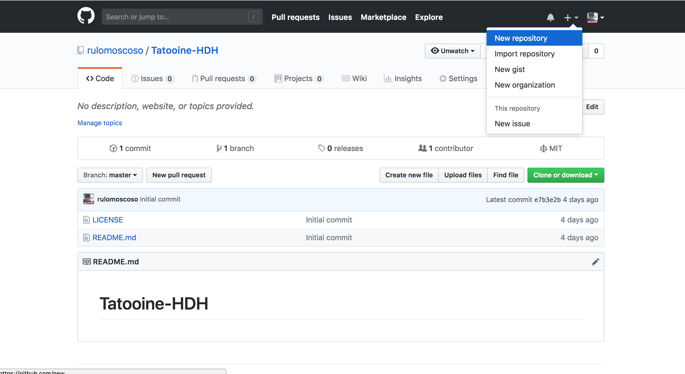
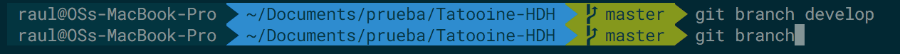

# Flujo completo de Git

1. ir a github.com y loguearse.
2. En la parte superior derecha hay un icono de "+" y hacemos clic en el icono.
3. Hacer clic en en la opcion de "New repository"

4. Dar un nombre al nuevo repositorio.
5. Colocar una descripcion del repositorio.
6. Marcar la opción "initialize this with a README", en "add a license" elegir "Mit License" y hacer clic en el boton create new repository.

7. Ahora nos reidreccionara a la pantalla donde ya se creo nuestro nuevo repositorio.
8. Buscamos el boton que dice "Clone o download" y copiamos la ruta que nos da.

9. Nos vamos a nuestro equipo local y abrimos una terminal nos movemos al directorio donde queremos clonar el proyecto, y escribimos el comando "git clone" seguido de la url que copiamos del repositorio de github, esto nos crea una copia local de nuestro repositorio de git.
10. Sabemos que ya estamos en nuestro repositorio local porque en el pront de la terminal nos coloca el nombre del directorio de trabajo y la rama donde estamos por default nos crea una rama llamada master.

11. La rama master no la vamos a modificar ya que esta la utilizaremos cuando lanzemos una realease del proyecto, entonces para comenzar a trabajar debemos de crear otra rama a la cual llamaremos develop (Este nombre es por buenas practicas aunque podemos darle el nombre que queramos) para crear otra rama utilizamos el comando "git branch" seguido del nombre de la rama.

12. Usamos el comando "git branch" para listar las ramas que tememos en nuestro repositorio y le coloca un asterisco para marcar la rama actual en la que estamos trabajando.

13. Nos cambiamos de rama con el comando "git checkout" seguido del nombre de la rama a la cual nos queremos cambiar.

14. Creamos una nueva rama para modificar el archivo readme.md, para esto utlizamos el comando git checkout -b seguido del nombre de la rama, esto crea la rama y a la vez nos cambia a la nueva rama.

15. Abrimos nuestro archivo readme.md y agregamos texto y guardamos los cambios, volvemos a la terminal e ingresamos el comando "git status", esto nos muestra el estado de nuestro repositorio en este caso detecta que hubo un cambio en un archivo y nos dice que archivo esta siendo modificado y que no esta en el staged.
   
16. Para agregar el archivo al stage usamos el comando "git add" seguido del nombre del archivo que fue modificado y con git status nuevamente vemos que ya fue agregado al staged y que esta en espera de que pase a commited.

17. Ahora que ya esta en el staged falta hacer un commit que esto lo que hace es registrar esos cambios en el repositorio.

18. Para subir estos cambios a nuestro repositorio remoto utlizamos el comando "git push origin" seguido del nombre de nuestra rama que queremos subir, origin es el nombre de nuestro servidor remoto.

19. En nuestro servidor de git nos aparecera la nueva rama que le acabamos de hacer push y a la derecha un boton que dice "compare & pull-request", hacemos clic para ver toda la informacion de nuestros cambios que subimos en esa rama.

20. Ahora comparamos nuestra rama con la base que deberia de ser develop y hacemos clic en el boton "Create pull request"
21. Confirmamos nuestro pull request y luego procedemos a eliminar nuestra rama que usamos para subir estos cambios.

22. Y luego en nuestro servidor local actualizamos nuestra rama de develop bajando los cambios con el comando "git pull origin" seguido del nombre de la rama.

23. Por ultimo procemos a eliminar la rama que trabajamos para no tener tantas ramas y luego confundirnos.

