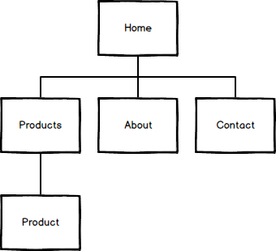
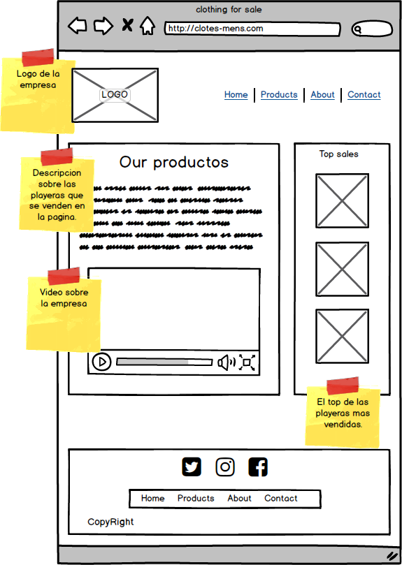
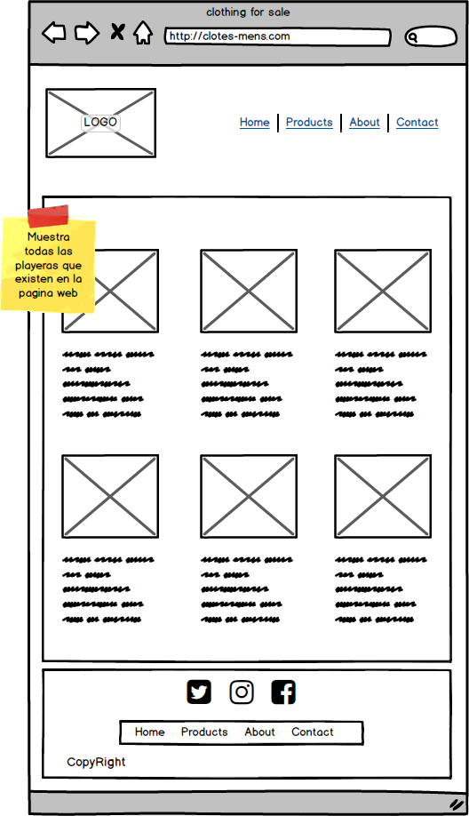
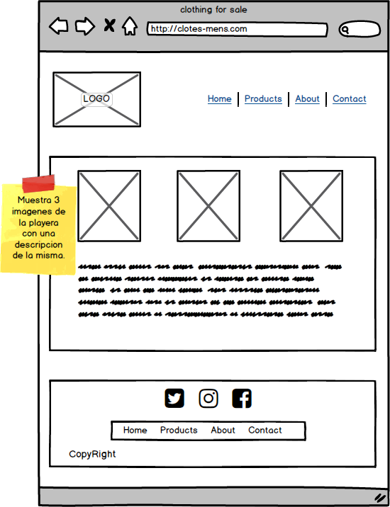
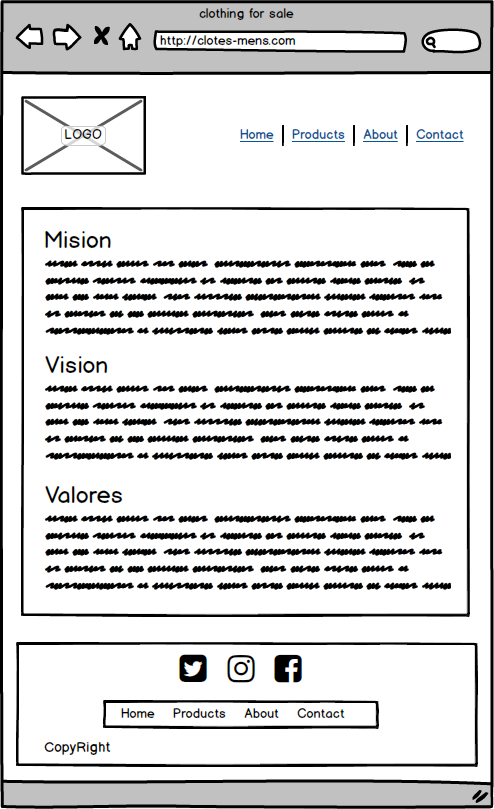
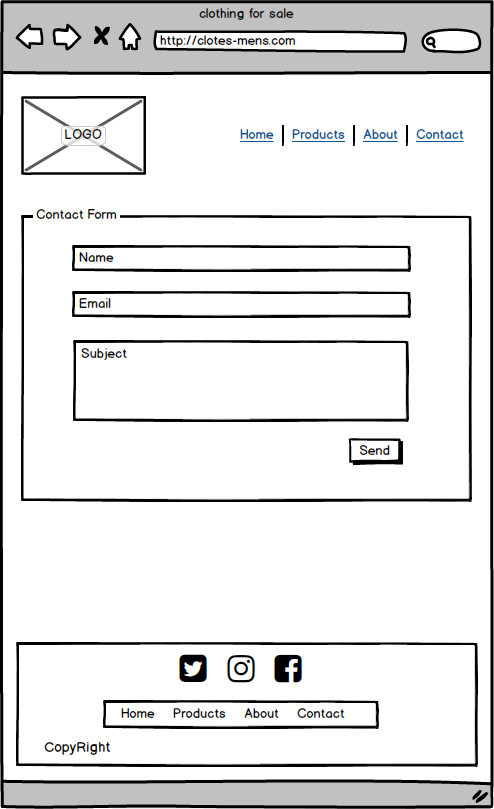

# Mapa del sitio

## Index
Productos:
> En esta sección mostramos las playeras con una breve descripción del tipo de playera.

Producto:
> Esta es la seccion que se muestra depues de haber elegido una de las playeras en la seccion de productos.

About:
> En esta sección es donde se coloca la mision, vision y valores de la empresa.

Contact:
> Esta seccion es para que el cliente pueda ponerse en contacto con la empresa.

# Wireframing

#### Home

Menu principal:
> El menu es un elemento muy importante ya que con este el usuario puede navegar en todas las secciones del sitio web, es por eso que se encuentra en la parte superior del sitio.

Our Products:
> Aqui se muestra una breve descripción de como se hacen los productos al igual que un video del proceso.

Top Sales:
> En esta sección del sitio se muestran 3 de las playeras mas vendidas en el sitio.

Footer:
> Aqui en esta sección estan los iconos de las redes sociales, nuevamente el menu para que ahi mismo puedas desplazarte a otra seccion sin necesidad de ir al principio de la pagina y por ultimo los derechos de copia.

#### Products

> Aqui se muestran las playeras disponibles, por medio de una imagen y una descripcion de la playera y al hacer clic nos lleva a la pagina del producto con una descrpcion larga y 3 imagenes del mismo

Paginate:
> Para poder mostrar todos los productos y no sea tan dificil para el usuario se utiliza un paginador de tal manera que en esta seccion se muestran 6 playeras por pagina.

#### Product

> En esta seccion se muestra la playera seleccionada en la seccion de Products, se visualizan 3 imagenes de las playeras de la parte delantera, trasera y de perfil, ademas una descripcion sobre la playera.

#### About

> En esta seccion se muestra la mision visio y valores de la empresa solo esta compuesto de texto descriptivo.

### Contact

> Aqui tenemos un formulario que solicita un correo un nombre y un asunto para que el usuario pueda comunicarse con la empresa si tiene algun problema o sugerencia.

